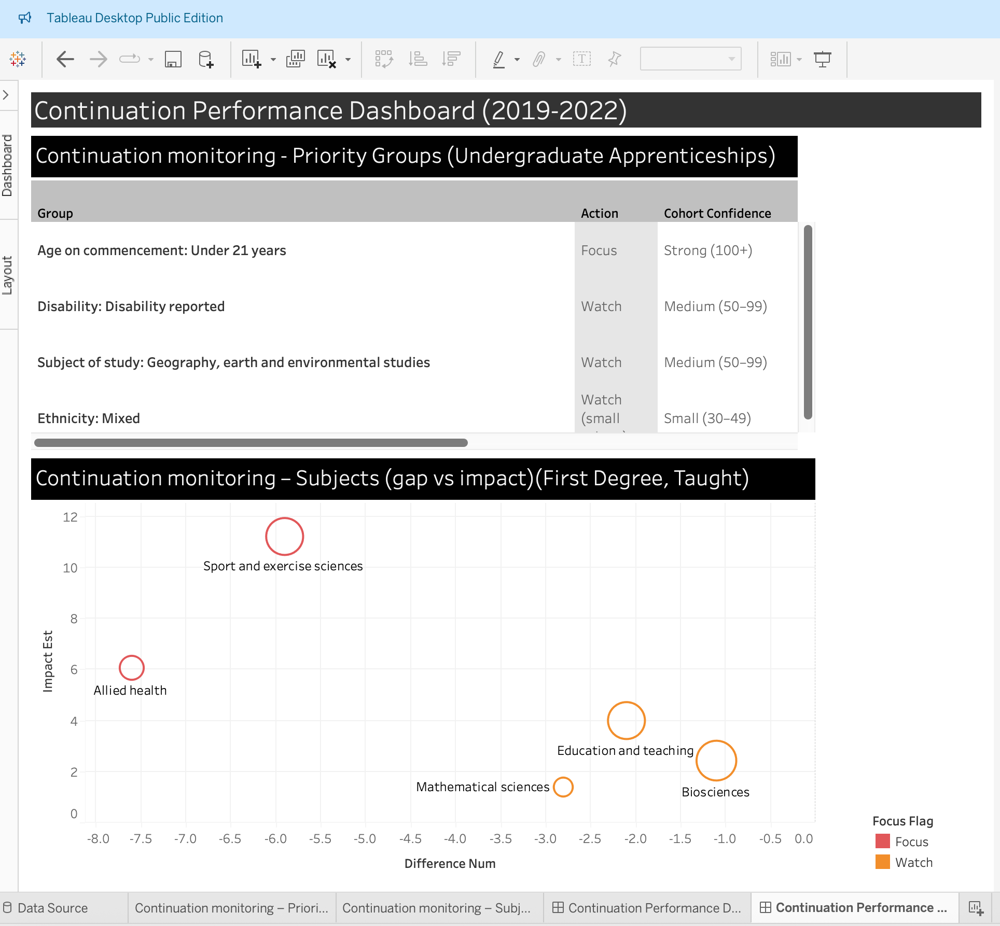

# Kingston University Institutional Performance Example Dashboard

This repository contains an example dashboard and supporting analysis using Office for Students (OfS) student outcomes indicators (Continuation: provider vs benchmark). It is a portfolio piece to demonstrate approach to performance monitoring, data preparation, and dashboard-ready outputs.

## What’s included
- Report: [Kingston_Report.pdf](report/Kingston_Report.pdf)
- Dashboard screenshot: `images/dashboard.png`
- Processed extracts used for the dashboard: `data/processed/`
- Notebook (data preparation): `notebooks/`

## Dashboard preview

## Data source (original “all providers” file)
The original OfS Student Outcomes dataset (all providers, zipped CSV) can be downloaded here:
- https://www.officeforstudents.org.uk/data-and-analysis/student-outcomes-data-dashboard/get-the-data/

## How to view
- Read the report in `report/`
- View the dashboard screenshot in `images/`
- The Tableau-ready extracts are in `data/processed/`
- The data preparation notebook is in `notebooks/`
